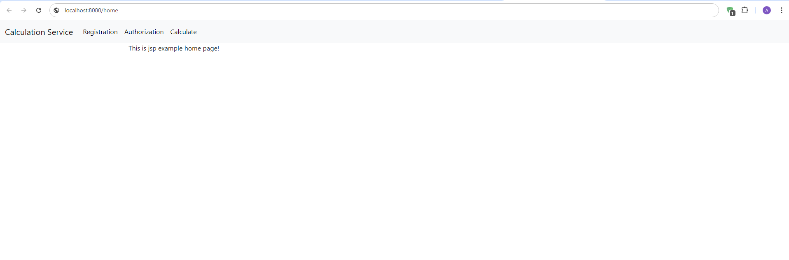
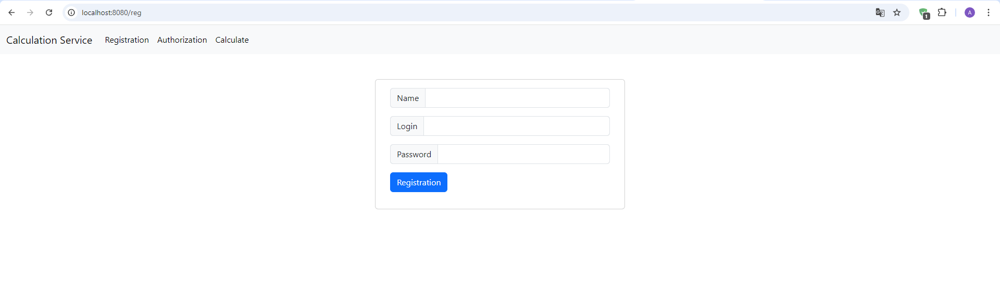
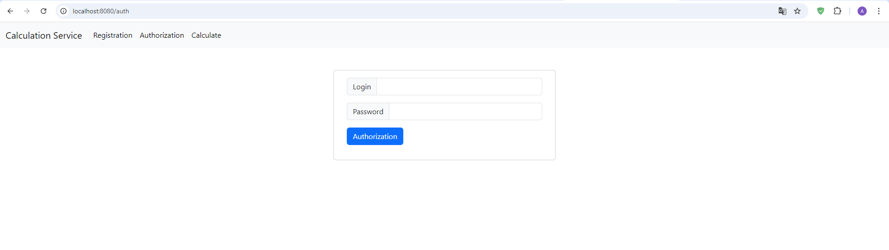
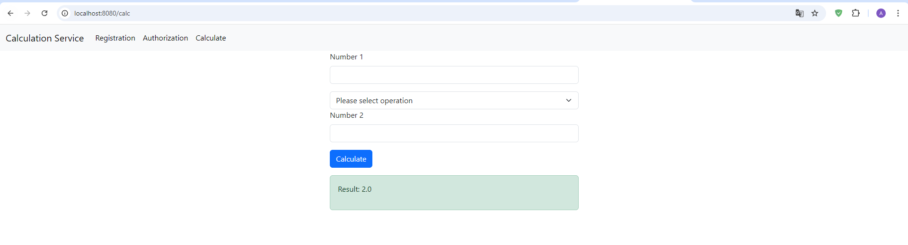

# Task

The task was to create a simple web application using servlets and JSP with three key functionalities: **Registration**, **Authorization**, and a **Calculator**. Bootstrap was used to create a responsive layout with a navbar for navigation between the registration, authorization, and calculator pages.

# Description

This project implements a web application with user registration, authorization, and a basic calculator for arithmetic operations. The core functionality of the application is the **Calculator**, which performs addition, subtraction, multiplication, and division operations. All interactions are implemented using JSP and servlets, which handle data processing on the server-side.

Bootstrap was used to style the frontend, providing a responsive navbar that allows users to switch between the **Registration**, **Authorization**, and **Calculator** pages. The servlets handle the logic for user management and calculations, while JSP is responsible for rendering the views.

### Technologies Used:
- **Java Servlet API**
- **JSP**
- **Bootstrap 5**
- **Tomcat 9**
- **Maven**
- **HTML & CSS**

## Screenshots:

### Home Page

### Registration Page

### Authorization Page

### Calculator Page

